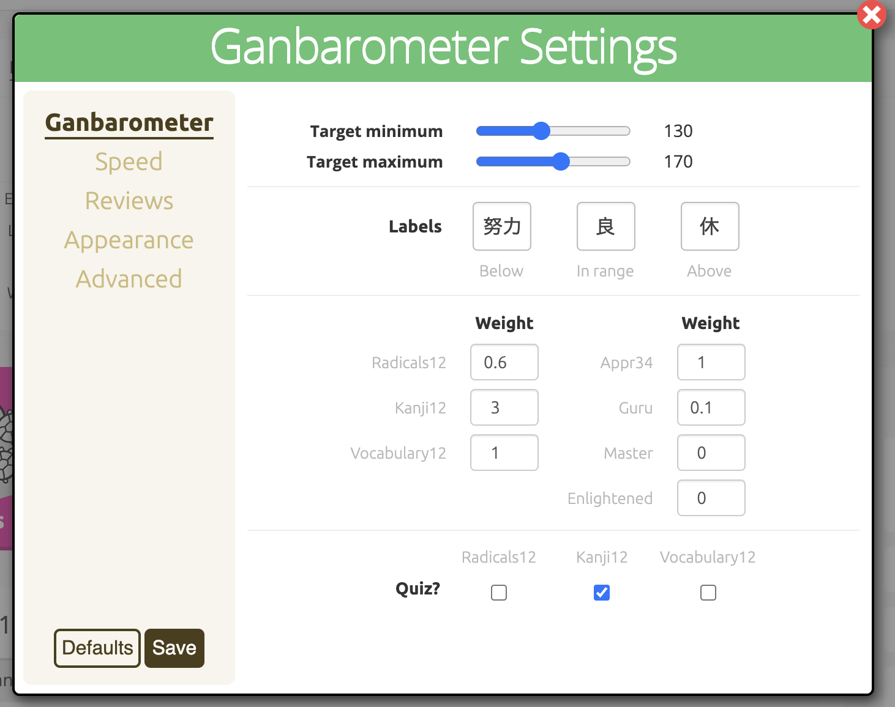

# The GanbarOmeter v5.0

At long last, I'm happy to release this thing to the wild. It's ... grown. It
dances, it sings, it names your offspring, it predicts the weather, it knows
what you had for breakfast ...

([I may have a
problem](https://community.wanikani.com/t/script-abusers-anonymous/45681/82?u=rrwrex).
Fear is the mind-killer ...)

## What is it?

This is a [tampermonkey](https://www.tampermonkey.net/) user script
that (primarily) adds three graphical widgets to the
[Wanikani](https://www.wanikani.com/about) dashboard. All three provide
information to help manage your workload as you progress through the WaniKani
levels.

Quit reading this crazy diatribe and [go install it already](#installation).

## User interface overview

There are three primary elements:

- The [GanbarOmeter](#The-GanbarOmeter) itself. This gauge helps you decide whether to slow down or
  speed up doing lessons. Basically, you want to keep the needle within the
  light green region.

- The Speed gauge. This gauge tells you how long you are taking on average to answer
  reading and meaning questions. (Note that this depends on several heuristics
  and statistical tricks. This information isn't measured, or at least not
  presented by the [Wanikani API](https://docs.api.wanikani.com).)

- The Reviews chart which displays a bar chart with how many reviews you
  performed each day (and the percentage of those reviews you answered correctly
  the first time).)

If you click the "Data" navigation at the top, the graphs are replaced with a
tabular view of the underlying data:

### Navigation

The menu on top has several navigational elements:

In addition to showing graphs or data, the nav bar includes:

- A slider at the top to choose the number of days worth of reviews to retrieve.

- An icon to pull up the preference setting dialog.

- (Optional) A launcher for @rfindley's [Self-Study Quiz](https://community.wanikani.com/t/userscript-self-study-quiz/13191) with just the "new"
  items in your assignment queue. "New" items are in stages 1 and 2 ("Apprentice
  1" and "Apprentice 2'). This icon only appears if you have the Self-Study Quiz
  installed. By default it will only quiz you on new Kanji, but you can choose
  whether to include radicals or vocabulary in the settings.

### The GanbarOmeter

The first and most important graphical element is the GanbarOmeter itself. The
purpose of this gauge is to tell you whether to slow down or speed up doing
lessons depending on the counts, types, and SRS stages of upcoming assignments.

The GanbarOmeter display a zero-center needle with three ranges. A numeric value
is calculated based on upcoming assignments. That value is compared to lower and upper
limits specified by the user. Values between the limits (in the green range)
display a “good” label. Below the lower limit (the yellowish range) displays a “more effort needed”
label. Above the upper limit (the reddish range) displays a “take a break” label.

### The Speed Gauge

The speed gauge show how long on average it takes you to answer an individual
reading or meaning question. There is a setting for the target speed, a computed
value exactly equal to the target will display the green dial at the 50% location. Faster (lower
seconds/question) will display in the lower part of the gauge, and slower in the
higher range. Values above or below the limits specified in the target will
change the label and display in a warning color.

Note that this displays how much time is spent on each _question_ (reading or
meaning, including repeat questions for prior incorrect answers). This is
quite different than the delay between individual review records (which is what the
API returns).

### The Reviews Chart

Finally, the review chart shows a great deal of information:

- The number of reviews performed each day.
- The percentage of _items_ answered correctly the first time (both meaning and
  reading).
- The target range (the light green box in the background).
- The expected daily number of reviews based on the makeup of the assignment
  queue (the horizontal dashed golden line).

If you hover your mouse over an individual reviews bar, it displays the number of review
items on that day as well as how many were answered correctly the first time
(both reading and meaning).

### Data view

The data view shows information in tabular form.

Note that the speed gauge displays the number of _sessions_ (consecutive strings
of reviews). It uses a statistical algorithm called the [median absolute
deviation](https://en.wikipedia.org/wiki/Median_absolute_deviation) on the
intervals between review records to find sessions.

To repeat, the speed table shows _question_ accuracy (the percentage of individual
reading or writing questions answered correctly) while the review accuracy table
displays _item_ accuracy (the percentage of review items where _both_ the
reading and meaning were answered correctly the first time).

### The day range slider

You can retrieve between one and seven days of reviews.

### Self-study

If @rfindley's [Self-Study Quiz](https://community.wanikani.com/t/userscript-self-study-quiz/13191) is installed, a hand-drawn icon should be
visible to launch it. (I tried to make it look like flash-cards). The idea is to
let you do "out-of-band" reviews of newly introduced items as often as possible
before doing your "proper" reviews within the SRS system.

Items in the first two stages have **very** short review-cycles. It doesn't hurt
to review the newest items more frequently. Once you answer them correctly
enough times in the real Wanikani SRS system, they'll move out of the earliest
stages.

I feel strongly that these "extra" reviews of items in the first two stages
isn't "cheating". The whole idea of an SRS is to repeat the stuff that needs it
as often as possible, and items in the first two stages absolutely **should** be
reviewed as much as possible.

Once they've left the earliest stages, it's best to let the SRS system figure
out when you should next review an item.

### Settings

Clicking the right-most icon will bring up the settings dialog:

There are separate sections for each of the different widgets. There are also
sections for "advanced" settings you shouldn't have to touch, as well as
appearance settings (including where on the dashboard you want to see the Ganbarometer,
and your prefered colors).

## Installation

1. Install a script manager of some sort. [Tampermonkey](https://chrome.google.com/webstore/detail/tampermonkey/dhdgffkkebhmkfjojejmpbldmpobfkfo?hl=en) or [Violentmonkey](https://github.com/violentmonkey/violentmonkey)
   should both work (I use Tampermonkey myself).

2. Install the [Wanikani Open Framework](https://community.wanikani.com/t/installing-wanikani-open-framework/28549).

3. Navigate to your [Wanikani dashboard](https://www.wanikani.com/dashboard).

4. Click on the tampermonkey settings (there should be an icon in your menu
   bar). If you happen to already have an older version of this script
   installed, please delete it. Open the tampermonkey dashboard and click the
   "Utilities" tab.

5. At the very bottom you will see "Install from URL". Cut and
   paste this URL into the box, and click "Install":
   `https://raw.githubusercontent.com/wrex/ganbarometer-svelte/main/published/v5/bundle.user.js`

6. Click "Install" on the next page to actually add the script. Then navigate back to your dashboard and
   refresh the page. You should now see the Ganbarometer!

## Why this script exists

Developing this has been a lot of fun. I've learned a ton (I didn't know
Javascript and barely knew HTML/CSS when I started).

More importantly, though, I've found this script incredibly **useful** as I
progress through the levels. Not to put too fine a point on it, I wrote this for
_myself_.

The Wanikani designers have done a truly amazing job. The site teaches you to read
kanji in the most efficient **AND ALMOST EFFORTLESS** way possible. It's like magic.

The only requirements are that you:

1. **DO ALL YOUR AVAILABLE REVIEWS EVERY SINGLE DAY**, and

2. _Do a sufficient number of **lessons** to maintain a "comfortable" pace while
   still meeting requirement 1._

In other words, you really **must** try to get your review queue down to zero at
least once every single day. (Life happens, and it's not the end of the world if you miss
a day or two here and there, but you'll pay for it in the end if you don't keep
up with your reviews.) Doing your reviews every day (or nearly) is non-negotiable.

_Lessons_ though, **feed** the review queue. The more lessons you do, the more
reviews you'll spend time on. _Lessons_ are the accelerator pedal, reviews are
miles under the wheels, and **there is no brake pedal!** Once you've completed a
lesson, you've launched that item into your review queue for the foreseeable
future — there's no pulling it back. Lessons you do today will have an impact
on your review workload _months_ in the future!

You've no choice regarding reviews, you've got to do them all. But it's
completely up to you to figure out how many lessons to do each day. Lessons are
the **only** thing under your control!

Very smart people who've gone before me have figured out various "algorithms" to
help figure out when to speed up or slow down with lessons. One common one is to
keep your "Apprentice Queue" at about 100 items.

A more sophisticated algorithm is to keep "apprentice items" (stages 1-4) plus
1/10th of "guru" items (stages 5 and 6) around 150 items.

To me, though, newly introduced characters were hardest of all. Each level would
start hard and become easier. In the first several days of a new level, all
those new kanji really made my reviews difficult. Once I got toward the end of a
level and started seeing more vocabulary using those characters in my reviews,
it got easier.

I started to slow down doing lessons immediately after leveling-up (when I
started seeing more of that "evil pink") then speed up at the end of a level
when new lessons were entirely vocabulary for the kanji I'd already learned.

I wanted a dashboard display that mad this mental calculation visible. Just
Tarzan-logic: "new kanji hard — slow down".

Enter the GanbarOmeter.

## How I use this

I do my reviews daily (only very rarely more than once per day). This means that
I "miss" the 4-hour and 8-hour review intervals for items in the first two
stages. I simply don't review items in the first two stages often enough.

So, every morning I pour a fresh cup of coffee and look at my dashboard. This
only takes a second, just a simple glance.

Unsurprisingly, the default settings for the script match my own
preferences.

I want the GanbarOmeter to calculate a weighted value somewhere
between 130 and 170 (this is roughly my number of Apprentice items, but early
kanji are weighted more heavily and I also count items in the guru stages to
account for leeches). Rather than doing mental gymnastics with numbers, I just
want to see the needle in the green zone, pointing almost vertical.

The speed dial is mostly to ensure I maintain a consistent pace. I don't like to
do more than 150 or so items in any individual session, and I don't want to take
more than a half-hour to forty-five minutes to do my reviews. A pace of about
6.5 seconds-per-question "feels" about right for me.

The review graph shows me how much work I've don't for the past few
days. If my expected number of daily reviews starts creeping up, I may decide to
do fewer lessons no matter what my GanbarOmeter says.

Next, I click on the self-study button to review kanji in the first two-stages
"out-of-band" (I only review kanji this way, ignoring radicals and vocabulary,
because I find them the most difficult). If I don't know an answer, I type "ke"
to answer incorrectly, then hit F1 to reveal the correct answer before moving
on.

At the beginning of a level, I might have 10 or more new kanji in stages 1 and 2. At the end of a level I'll rarely have any.

Regardless, I'll repeat the self-study quiz until I can answer all the items
100% correctly. Then I'll hit the escape key three times in a row and start my
"real" Wanikani review session.

The Wanikani review session proceeds normally. I'm **NOT** a fan of re-ordering
script or whatever. I've no qualms about displaying additional information, but
I'm extremely suspicious of anything that actually changes how the Wanikani SRS
system actually behaves.

About the only thing I do differently than many during my reviews is to spend
time on incorrect answers as I go, trying to figure out why I missed it. Many
people wait until the end of their review sessions to figure out why they missed
things. It's very much personal preference.

Only after my review session do I decide whether or not to do any lessons. I
navigate back to the dashboard to ensure I have the latest GanbarOmeter value
displayed. If it's in the green (or on the left side) I'll do at least 5
lessons, if not 10, 15 or even 20 lessons.

In practice, I might think I want to do a large number of lessons because the
GanbarOmeter displayed a highly left-of-center value, but after doing 5 lessons
I might choose to bail if they seemed harder than usual.

Toward the end of a level, though, the vocabulary lessons often seem easy, so I
might choose to do **more** lessons than the GanbarOmeter might seem to
indicate.

In other words, the GanbarOmeter provides **input** to my decision making
process. I don't just follow it's guidance automatically.

## Development Notes

I developed this using the [svelte](https://svelte.dev) compiler, using [typescript](https://typescriptlang.org) for
compile-time type checking, [jest](https://jestjs.io) as a testing framework, and [Testing
Library](https://testing-library.com) for additional testing semantics. I used Lucas Shanley's
wonderful [tampermonkey-svelte](https://github.com/lpshanley/tampermonkey-svelte) template to package up my code as a user script.

It uses two primary widgets: a `Gauge.svelte` to display a dial gauge, and
`BarChart.svelte` to render a bar chart. Both were hand developed by me using
Test Driven Development.

The basic CSS for the dial gauges came from [this excellent tutorial by
dcode-software](https://youtu.be/FnUkVcQ_3CQ). I stole the basic layout of the
BarChart from this [Codepen by Ion Emil
Negoita](https://codepen.io/inegoita/pen/YMrJGY).

Shout-out to Basar Buyukkahraman's wonderful course on [TDD
with Svelte](https://www.udemy.com/course/svelte-with-test-driven-development/).

The code leverage @rfindley's wonderful WaniKani Open Framework user script to
retrieve and cache results where possible. He and @kumirei from the Wanikani
community helped me get started with this user script business!

If you want to help with development or simply want to validate that nothing
nefarious is included in the user script:

1. You'll need to enable `Allow access to file URL's` in the Chrome extension
   for tampermonkey. This is conceivably a security risk, so you may want to
   disable the setting again after finishing your development work. See
   [tampermonkey-svelte](https://github.com/lpshanley/tampermonkey-svelte) for details.

2. Download the source from the [github repository](https://github.com/wrex/ganbarometer-svelte).

3. Run `npm install` to install all the dependencies for compilation.

4. Before compiling or running the code, you may want to type `npm run test`. All tests should pass.

5. In one shell window, type `tsc -w` to run the typescript compiler in watch mode.

6. In another shell window, type `npm run dev` to compile a (un-minified) dev version of the code and prepare for "live" updates.

7. Copy the top several lines of the file `./dist/bundle.user.js`. Just copy the header itself, everything through and including the `// ==/UserScript==` line. Don't copy any actual code.

8. In the tampermonkey dashboard, click the "+" tab and paste in the headers (again, just the headers) from step 6. Save the file. This will install the `ganbarometer-svelte ->dev` script and prepare it for "live" updates. If you browse to the WK dashboard, and enable this version of the script, any changes you make to the source code should show up when you refresh the page.

This is still BETA code: I plan a fair bit of clean-up and refactoring. Please be kind (I'm just an amateur) but any thoughts or comments are quite welcome. Hopefully, it isn't too hard to figure out the current code organization. It's definitely FAR better code than the currently published version of the script.

## TODO

- I still need to write more unit tests

- Doubtless, bugs still lurk. The best way to find them is to put this out
  there, though. Please let me know if you discover any.

- I'd like to disable the self-study quiz if there are no no items available.
  The self-study quiz itself does the right thing if there aren't any available,
  but it would be nice to save a click.

- I'm currently caching the processed data for each widget, but each time the
  dashboard gets refreshed I pull down 1 to 7 days worth of reviews (and all the
  assignments) from the Wanikani API. I really want to start caching these raw
  reviews as well, but I plan to release that as a separate project. I'll create
  a new version of the Ganbarometer once that cache is complete.
