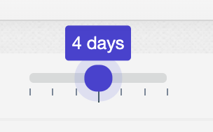

# The GanbarOmeter (svelte version)

This is a [tampermonkey](https://www.tampermonkey.net/) user script
intended for people learning to read Japanese kanji characters with
[Wanikani](https://www.wanikani.com/about).

It adds three graphical widgets to the dashboard view (as well as a tabular view
of the underlying values).)

## User interface

This shows the three primary widgets, the navigation to display graphs or
data-tables, a slider to change the number of days worth of reviews to retrieve,
an icon to launch @rfindley's Self-Study quiz, and an icon to change the
settings.

### The GanbarOmeter

The first and most important graphical element is the GanbarOmeter itself. The
purpose of this gauge is to tell you whether to slow down or speed up doing
lessons depending on the counts, types, and SRS stages of upcoming assignments.

The GanbarOmeter display a zero-center needle with three ranges. A numeric value
is calculated based on upcoming assignments. That value is compared to lower and upper
limits specified by the user. Values between the limits (in the gray range)
display a “good” label. Below the lower limit (the yellowish range) displays a “more effort needed”
label. Above the upper limit (the reddish range) displays a “take a break” label.

Here are the settings for the GanbarOmeter (showing the default values):

### The Speed Gauge

The speed gauge show how long on average it takes you to answer an individual
reading or meaning question. There is a setting for the target speed, a value at
the target will display the green dial at the 50% location. Faster (lower
seconds/question) will display in the lower part of the gauge, and slower in the
higher range.

Note that this displays how much time is spent on each _question_ (reading or
meaning, including repeat questions for prior incorrect answers).

### The Reviews Chart

Finally, the review chart shows a great deal of information:

- The number of reviews performed each day.
- The percentage of items answered correctly the first time (both meaning and
  reading).
- The target range (the light green box in the background).
- The expected daily number of reviews based on the makeup of the assignment
  queue (the horizontal dashed golden line).

If you hover your mouse over an accuracy bar, it displays the number of review
items on that day as well as how many were answered correctly the first time
(both reading and meaning).

### The day range slider

You can retrieve between one and seven days of reviews.

### Data view

The data view shows information in tabular form.

Note that the speed gauge displays the number of _sessions_ (consecutive strings
of reviews). It performs a statistical algorithm called the [median absolute
deviation](https://en.wikipedia.org/wiki/Median_absolute_deviation) on the
intervals between review records to find sessions.

To repeat, the speed table shows _question_ accuracy (the percentage of individual
reading or writing questions answered correctly) while the review accuracy table
displays _item_ accuracy (the percentage of review items where _both_ the
reading and meaning were answered correctly the first time).

## Beta version installation

(The following presumes you already have Tampermonkey and the Wanikani Open
Framework installed.)

1. Navigate to your Wanikani dashboard, click on the tampermonkey settings, and
   disable the current ganbarometer script if you already have an older version
   installed (there is no point in running both).

2. Open the tampermonkey dashboard, click the "Utilities" tab. At the very bottom you will see "Install from URL". Cut and paste this URL into the box, and click "Install": https://raw.githubusercontent.com/wrex/ganbarometer-svelte/main/published/beta0/bundle.js

3. Click "Install" on the next page. Then navigate back to your dashboard and
   refresh the page. You should see the new version shown in the screenshots in
   the previous post.

4. If you had a previous beta installed, you may need to refresh your stored
   settings: Open the Settings dialog by clicking on the icon. Then click the
   "defaults" button, followed by the "save" button. You must currently close
   the dialog explicitly by clicking the red X in the upper right corner after
   saving (this will be fixed in the production version).

## Notes

I developed this using the [svelte](https://svelte.dev) compiler, using [typescript](https://typescriptlang.org) for
compile-time type checking, [jest](https://jestjs.io) as a testing framework, and [Testing
Library](https://testing-library.com) for additional testing semantics. I used Lucas Shanley's
wonderful [tampermonkey-svelte](https://github.com/lpshanley/tampermonkey-svelte) template to package up my code as a user script.

It uses two primary widgets: a `Gauge.svelte` to display a dial gauge, and
`BarChart.svelte` to render a bar chart. Both were hand developed by me using
Test Driven Development.

The basic CSS for the dial gauges came from [this excellent tutorial by
dcode-software](https://youtu.be/FnUkVcQ_3CQ). I stole the basic layout of the
BarChart from this [Codepen by Ion Emil
Negoita](https://codepen.io/inegoita/pen/YMrJGY).

Shout-out to Basar Buyukkahraman's wonderful course on [TDD
with Svelte](https://www.udemy.com/course/svelte-with-test-driven-development/).

The code leverage @rfindley's wonderful WaniKani Open Framework user script to
retrieve and cache results where possible. He and @kumirei from the Wanikani
community helped me get started with this user script business!

If you want to help with development or simply want to validate that nothing
nefarious is included in the user script:

1. You'll need to enable `Allow access to file URL's` in the Chrome extension
   for tampermonkey. This is conceivably a security risk, so you may want to
   disable the setting again after finishing your development work. See
   [tampermonkey-svelte](https://github.com/lpshanley/tampermonkey-svelte) for details.

2. Download the source from the [github repository](https://github.com/wrex/ganbarometer-svelte).

3. Run `npm install` to install all the dependencies for compilation.

4. Before compiling or running the code, you may want to type `npm run test`. All tests should pass.

5. In one shell window, type `tsc -w` to run the typescript compiler in watch mode.

6. In another shell window, type `npm run dev` to compile a (un-minified) dev version of the code and prepare for "live" updates.

7. Copy the top several lines of the file `./dist/bundle.js`. Just copy the header itself, everything through and including the `// ==/UserScript==` line. Don't copy any actual code.

8. In the tampermonkey dashboard, click the "+" tab and paste in the headers (again, just the headers) from step 6. Save the file. This will install the `ganbarometer-svelte ->dev` script and prepare it for "live" updates. If you browse to the WK dashboard, and enable this version of the script, any changes you make to the source code should show up when you refresh the page.

This is still BETA code: I plan a fair bit of clean-up and refactoring. Please be kind (I'm just an amateur) but any thoughts or comments are quite welcome. Hopefully, it isn't too hard to figure out the current code organization. It's definitely FAR better code than the currently published version of the script.

## TODO

- make all settings functional:
  - speed warning levels
  - appearance settings
  - tz offset
- Style the settings dialog
  - use CSS variables everywhere
  - add warn/error color ranges to gauges
  - add warn/error color to accuracy bars if % too low
  - disable the save button on validation errors, close modal on save
- more tests
- code cleanup (remove unused CSS selectors, etc.)
- update readme (ready to publish)
- "debounce" changes to retrieval days setting (?)
- Write a [[new version of review-cache]]
